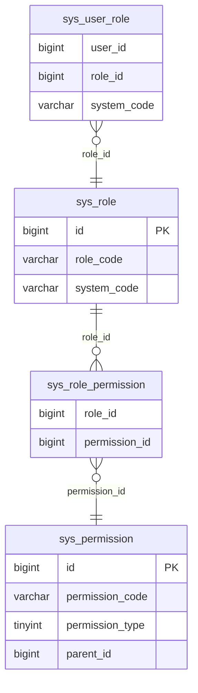

# 数据库设计文档（基础表 + RBAC）

| 项 | 值 |
|----|-----|
| 适用变更 | `openspec/changes/add-unified-auth-center` |
| 范围 | 认证身份库 `auth_db`、各业务系统 RBAC/投影表 |
| 状态 | 设计稿（迁移脚本以此为输入） |
| 约定来源 | `CLAUDE.md` §6.4–6.5、本变更 design |

---

## 1. 设计原则

1. **两库两责**：`auth_db` 只存身份与凭证（仅 `auth-service` 读写）；各业务库存本地 RBAC 与用户投影（无密码）。
2. **无物理外键**：逻辑关联用同名业务字段；应用层保证一致性。
3. **主键 14 位**：`id` = `yyMMdd(6) + 当日序号(8)`，由 `sys_sequence` 发号，**禁止自增**。
4. **审计五件套**：`create_time` / `update_time` / `create_by` / `update_by` / `deleted`。
5. **逻辑删除**：业务主表 `deleted` 0/1；**关联表物理删**，避免 UK 与逻辑删除冲突。
6. **命名**：表/字段 `snake_case`，表名单数；索引 `idx_表_字段` / `uk_表_字段`；单表索引 ≤ 5。
7. **类型**：状态/标记 `TINYINT`，时间 `DATETIME`，金额 `DECIMAL`（本域暂无），定长文本 `VARCHAR`，字符集 `utf8mb4`。

### 1.1 关联字段约定（跨表）

| 关联 | 字段 | 物理 FK | 说明 |
|------|------|---------|------|
| 用户 → 部门 | `sys_user.dept_id` | 无 | 逻辑指向 `sys_dept.id` |
| 部门树 | `sys_dept.parent_id` / `ancestors` | 无 | 根 `parent_id=0` |
| 用户 ↔ 角色 | `sys_user_role.user_id` + `role_id` | 无 | `user_id` → **auth_db.sys_user.id** |
| 角色 ↔ 权限 | `sys_role_permission.role_id` + `permission_id` | 无 | 同系统内 |
| 权限树 | `sys_permission.parent_id` | 无 | 根 `0` |
| 投影 → 用户 | `sys_user_ref.user_id` | 无 | = 中心 `sys_user.id` |
| 系统维度 | `system_code`（角色/权限/关联冗余） | 无 | 同一业务系统内一致 |
| 发号 | `sys_sequence.seq_name` + `seq_date` | 无 | UK 组合 |

跨库唯一强关联：**`user_id` 必须等于认证中心 `sys_user.id`**，禁止业务库自造用户主键。

---

## 2. 库与表清单

| 库 | 表 | 职责 | 读写方 |
|----|----|------|--------|
| `auth_db` | `sys_sequence` | 发号 | auth-service |
| `auth_db` | `sys_user` | 用户权威 + 凭证 | 仅 auth-service |
| `auth_db` | `sys_dept` | 全局部门树 | 仅 auth-service |
| `auth_db` | `sys_login_log` | 登录审计（可选） | 仅 auth-service |
| `auth_db` | `sys_sso_client` | SSO 客户端白名单（可选） | 仅 auth-service |
| `{system}_db` | `sys_sequence` | 本系统发号 | 本系统服务 |
| `{system}_db` | `sys_role` | 本系统角色 | 本系统 |
| `{system}_db` | `sys_permission` | 菜单/按钮/API | 本系统 |
| `{system}_db` | `sys_user_role` | 用户↔角色 | 本系统 |
| `{system}_db` | `sys_role_permission` | 角色↔权限 | 本系统 |
| `{system}_db` | `sys_user_ref` | 用户展示投影（可选） | 本系统只读同步 |
| `{system}_db` | （业务表） | 各系统自有 | 本系统 |

---

## 3. `auth_db` 表结构

### 3.1 `sys_sequence` — 发号表

| # | 字段 | 类型 | NULL | 默认 | 键 | 说明 |
|---|------|------|------|------|----|------|
| 1 | id | BIGINT | N | — | PK | 14 位或任意唯一 |
| 2 | seq_name | VARCHAR(64) | N | `default` | UK1 | 序列名 |
| 3 | seq_date | CHAR(8) | N | — | UK1 | 业务日 `yyyyMMdd` |
| 4 | current_val | BIGINT | N | 0 | — | 当日已发序号 |
| 5 | create_time | DATETIME | N | — | — | |
| 6 | update_time | DATETIME | N | — | — | |
| 7 | create_by | BIGINT | N | 0 | — | |
| 8 | update_by | BIGINT | N | 0 | — | |
| 9 | deleted | TINYINT | N | 0 | — | 通常不删 |

- **UK**：`uk_sys_sequence_name_date (seq_name, seq_date)`
- **取号**：`UPDATE … SET current_val = current_val + 1 WHERE seq_name=? AND seq_date=?`，再拼 `yyMMdd + LPAD(val,8,'0')`

业务库内 `sys_sequence` 同构。

---

### 3.2 `sys_user` — 用户（身份权威）

| # | 字段 | 类型 | NULL | 默认 | 键 | 说明 |
|---|------|------|------|------|----|------|
| 1 | id | BIGINT | N | — | PK | 14 位；跨系统 `user_id` |
| 2 | username | VARCHAR(64) | N | — | UK1 | 登录名，全局唯一 |
| 3 | password_hash | VARCHAR(100) | N | — | — | BCrypt；禁止出业务库 |
| 4 | real_name | VARCHAR(64) | N | `''` | — | 姓名 |
| 5 | nickname | VARCHAR(64) | N | `''` | — | 昵称 |
| 6 | email | VARCHAR(128) | N | `''` | — | 出参脱敏 |
| 7 | phone | VARCHAR(20) | N | `''` | — | 出参脱敏 |
| 8 | avatar | VARCHAR(255) | N | `''` | — | URL |
| 9 | dept_id | BIGINT | N | 0 | IDX2 | → `sys_dept.id` |
| 10 | status | TINYINT | N | 1 | IDX3 | 1 启用 / 0 停用 |
| 11 | last_login_time | DATETIME | Y | NULL | — | |
| 12 | last_login_ip | VARCHAR(64) | N | `''` | — | |
| 13 | pwd_update_time | DATETIME | Y | NULL | — | |
| 14 | remark | VARCHAR(255) | N | `''` | — | |
| 15 | create_time | DATETIME | N | — | — | |
| 16 | update_time | DATETIME | N | — | — | |
| 17 | create_by | BIGINT | N | 0 | — | |
| 18 | update_by | BIGINT | N | 0 | — | |
| 19 | deleted | TINYINT | N | 0 | — | 0/1 |

- **UK1**：`uk_sys_user_username (username)`
- **IDX2**：`idx_sys_user_dept_id (dept_id)`
- **IDX3**：`idx_sys_user_status (status)`
- **关联**：`dept_id` → `sys_dept.id`；被 `sys_user_role.user_id`、`sys_user_ref.user_id` 引用
- **禁止**：存角色、权限、token、sid

---

### 3.3 `sys_dept` — 部门（全局组织树）

| # | 字段 | 类型 | NULL | 默认 | 键 | 说明 |
|---|------|------|------|------|----|------|
| 1 | id | BIGINT | N | — | PK | |
| 2 | parent_id | BIGINT | N | 0 | IDX1 | 父部门；根 0 |
| 3 | ancestors | VARCHAR(500) | N | `''` | — | 祖先路径 `0,1,5` |
| 4 | dept_name | VARCHAR(64) | N | — | — | |
| 5 | dept_code | VARCHAR(64) | N | `''` | UK2 | 业务编码 |
| 6 | sort | INT | N | 0 | — | |
| 7 | status | TINYINT | N | 1 | — | 1/0 |
| 8 | leader_id | BIGINT | N | 0 | — | → `sys_user.id` |
| 9 | remark | VARCHAR(255) | N | `''` | — | |
| 10–14 | 审计五件套 | | | | | 同 `sys_user` |

- **IDX1**：`idx_sys_dept_parent_id (parent_id)`
- **UK2**：`uk_sys_dept_dept_code (dept_code)`（若允许空 code，改为普通索引）
- **关联**：`parent_id` 自关联；`leader_id` → `sys_user.id`；被 `sys_user.dept_id` 引用

---

### 3.4 `sys_login_log` — 登录日志（可选）

| # | 字段 | 类型 | NULL | 默认 | 键 | 说明 |
|---|------|------|------|------|----|------|
| 1 | id | BIGINT | N | — | PK | |
| 2 | user_id | BIGINT | N | 0 | IDX1 | → `sys_user.id` |
| 3 | username | VARCHAR(64) | N | `''` | — | 快照 |
| 4 | login_ip | VARCHAR(64) | N | `''` | — | |
| 5 | user_agent | VARCHAR(255) | N | `''` | — | |
| 6 | status | TINYINT | N | 0 | — | 1 成功 / 0 失败 |
| 7 | message | VARCHAR(255) | N | `''` | — | 失败原因 |
| 8 | login_time | DATETIME | N | — | IDX2 | |
| 9–13 | 审计五件套 | | | | | 可简化，建议保留 |

- **IDX1**：`idx_sys_login_log_user_id`
- **IDX2**：`idx_sys_login_log_login_time`

---

### 3.5 `sys_sso_client` — SSO 客户端（可选）

> 首期可用 Nacos 白名单替代；客户端 ≥3 再建表。

| # | 字段 | 类型 | NULL | 默认 | 键 | 说明 |
|---|------|------|------|------|----|------|
| 1 | id | BIGINT | N | — | PK | |
| 2 | client_id | VARCHAR(64) | N | — | UK1 | 如 `system-a` |
| 3 | client_name | VARCHAR(64) | N | — | — | 显示名 |
| 4 | return_url | VARCHAR(255) | N | — | — | 允许回跳 URL（可多条 JSON/子表） |
| 5 | status | TINYINT | N | 1 | — | |
| 6–10 | 审计五件套 | | | | | |

- **UK1**：`uk_sys_sso_client_client_id (client_id)`

---

## 4. 业务系统库 RBAC 表（每系统一套）

### 4.1 `sys_role` — 角色

| # | 字段 | 类型 | NULL | 默认 | 键 | 说明 |
|---|------|------|------|------|----|------|
| 1 | id | BIGINT | N | — | PK | |
| 2 | system_code | VARCHAR(32) | N | — | UK1, IDX1 | 系统标识 |
| 3 | role_code | VARCHAR(64) | N | — | UK1 | 系统内唯一 |
| 4 | role_name | VARCHAR(64) | N | — | — | |
| 5 | sort | INT | N | 0 | — | |
| 6 | status | TINYINT | N | 1 | — | |
| 7 | data_scope | TINYINT | N | 1 | — | 预留：1 全部/2 本部门/3 本及下/4 本人/5 自定义 |
| 8 | remark | VARCHAR(255) | N | `''` | — | |
| 9–13 | 审计五件套 | | | | | |

- **UK1**：`uk_sys_role_system_code (system_code, role_code)`
- **IDX1**：`idx_sys_role_system_code (system_code)`（与 UK 前缀重复时可省略，保持 ≤5）
- **关联**：被 `sys_user_role.role_id`、`sys_role_permission.role_id` 引用

---

### 4.2 `sys_permission` — 权限（菜单 / 按钮 / API）

| # | 字段 | 类型 | NULL | 默认 | 键 | 说明 |
|---|------|------|------|------|----|------|
| 1 | id | BIGINT | N | — | PK | |
| 2 | system_code | VARCHAR(32) | N | — | UK1, IDX1 | |
| 3 | parent_id | BIGINT | N | 0 | IDX2 | 权限树；根 0 |
| 4 | permission_type | TINYINT | N | — | — | **1 menu / 2 button / 3 api** |
| 5 | permission_code | VARCHAR(128) | N | — | UK1 | 如 `sys:user:list` |
| 6 | permission_name | VARCHAR(64) | N | — | — | |
| 7 | path | VARCHAR(255) | N | `''` | — | 菜单路由 |
| 8 | component | VARCHAR(255) | N | `''` | — | 前端组件 |
| 9 | icon | VARCHAR(64) | N | `''` | — | |
| 10 | sort | INT | N | 0 | — | |
| 11 | visible | TINYINT | N | 1 | — | 菜单是否显示 |
| 12 | status | TINYINT | N | 1 | — | |
| 13 | method | VARCHAR(16) | N | `''` | — | type=api：GET/POST… |
| 14 | api_path | VARCHAR(255) | N | `''` | — | type=api：路径 |
| 15 | permission_str | VARCHAR(128) | N | `''` | — | 与 `@PreAuthorize` 对齐；可等于 code |
| 16 | remark | VARCHAR(255) | N | `''` | — | |
| 17–21 | 审计五件套 | | | | | |

- **UK1**：`uk_sys_permission_code (system_code, permission_code)`
- **IDX2**：`idx_sys_permission_parent_id (parent_id)`
- **关联**：`parent_id` 自关联；被 `sys_role_permission.permission_id` 引用

---

### 4.3 `sys_user_role` — 用户 ↔ 角色

| # | 字段 | 类型 | NULL | 默认 | 键 | 说明 |
|---|------|------|------|------|----|------|
| 1 | id | BIGINT | N | — | PK | |
| 2 | user_id | BIGINT | N | — | UK1, IDX1 | → **auth `sys_user.id`** |
| 3 | role_id | BIGINT | N | — | UK1, IDX2 | → `sys_role.id` |
| 4 | system_code | VARCHAR(32) | N | — | IDX3 | 与角色一致，便于清理 |
| 5 | create_time | DATETIME | N | — | — | 可保留审计子集 |
| 6 | create_by | BIGINT | N | 0 | — | |
| 7 | deleted | TINYINT | N | 0 | — | **删除用物理删** |

- **UK1**：`uk_sys_user_role_user_role (user_id, role_id)`
- **IDX1**：`idx_sys_user_role_user_id`
- **IDX2**：`idx_sys_user_role_role_id`
- **IDX3**：`idx_sys_user_role_system_code`
- **关联**：`user_id` 跨库逻辑 → `auth_db.sys_user`；`role_id` → `sys_role`
- **禁止**：username / password / real_name 作权威

---

### 4.4 `sys_role_permission` — 角色 ↔ 权限

| # | 字段 | 类型 | NULL | 默认 | 键 | 说明 |
|---|------|------|------|------|----|------|
| 1 | id | BIGINT | N | — | PK | |
| 2 | role_id | BIGINT | N | — | UK1, IDX1 | → `sys_role.id` |
| 3 | permission_id | BIGINT | N | — | UK1, IDX2 | → `sys_permission.id` |
| 4 | system_code | VARCHAR(32) | N | — | — | 与角色/权限一致 |
| 5 | create_time | DATETIME | N | — | — | |
| 6 | create_by | BIGINT | N | 0 | — | |
| 7 | deleted | TINYINT | N | 0 | — | **物理删** |

- **UK1**：`uk_sys_role_permission_rp (role_id, permission_id)`
- **IDX1**：`idx_sys_role_permission_role_id`
- **IDX2**：`idx_sys_role_permission_permission_id`

---

### 4.5 `sys_user_ref` — 用户投影（可选，只读）

| # | 字段 | 类型 | NULL | 默认 | 键 | 说明 |
|---|------|------|------|------|----|------|
| 1 | user_id | BIGINT | N | — | PK | = `auth sys_user.id` |
| 2 | username | VARCHAR(64) | N | `''` | — | 展示 |
| 3 | real_name | VARCHAR(64) | N | `''` | — | 展示 |
| 4 | status | TINYINT | N | 1 | — | **仅展示，不放行** |
| 5 | dept_id | BIGINT | N | 0 | — | |
| 6 | dept_name | VARCHAR(64) | N | `''` | — | 冗余减少查人 |
| 7 | sync_time | DATETIME | N | — | — | |
| 8 | source_version | BIGINT | N | 0 | — | 中心版本，对账 |
| 9 | create_time | DATETIME | N | — | — | 可简化 |
| 10 | update_time | DATETIME | N | — | — | |

- **关联**：PK 即 `user_id` → 中心用户；可被成员列表 JOIN
- **不含**：`password_hash`、角色、权限

---

## 5. 关联字段总图（如何 JOIN）

```
auth_db                         {system}_db
───────                         ───────────
sys_dept.id ◄──dept_id── sys_user.id
     ▲                        │
     │                        │ user_id（逻辑跨库）
     │ leader_id              ▼
     └────────────────  sys_user_role.user_id
                              │ role_id
                              ▼
                           sys_role.id
                              │ role_id
                              ▼
                      sys_role_permission
                              │ permission_id
                              ▼
                      sys_permission.id
                              │ parent_id（树）

sys_user.id ◄──PK=user_id── sys_user_ref
```

**典型查询：**

```text
-- 用户在某系统的权限码
SELECT DISTINCT p.permission_code
FROM sys_user_role ur
JOIN sys_role_permission rp ON rp.role_id = ur.role_id AND rp.deleted = 0
JOIN sys_permission p ON p.id = rp.permission_id AND p.deleted = 0
JOIN sys_role r ON r.id = ur.role_id AND r.deleted = 0
WHERE ur.user_id = ?
  AND ur.system_code = ?
  AND r.status = 1 AND p.status = 1;

-- 角色成员展示
SELECT ur.user_id, r.username, r.real_name
FROM sys_user_role ur
LEFT JOIN sys_user_ref r ON r.user_id = ur.user_id
WHERE ur.role_id = ?;
```

---

## 6. ER 图

### 6.1 全局（auth 身份 + 业务 RBAC）

```mermaid
erDiagram
    sys_sequence {
        bigint id PK
        varchar seq_name
        char seq_date
        bigint current_val
    }
    sys_user {
        bigint id PK
        varchar username UK
        varchar password_hash
        bigint dept_id FK_logical
        tinyint status
    }
    sys_dept {
        bigint id PK
        bigint parent_id
        varchar ancestors
        varchar dept_name
        bigint leader_id FK_logical
    }
    sys_login_log {
        bigint id PK
        bigint user_id FK_logical
        tinyint status
        datetime login_time
    }
    sys_sso_client {
        bigint id PK
        varchar client_id UK
        varchar return_url
    }
    sys_role {
        bigint id PK
        varchar system_code
        varchar role_code
        tinyint data_scope
    }
    sys_permission {
        bigint id PK
        varchar system_code
        bigint parent_id
        tinyint permission_type
        varchar permission_code
    }
    sys_user_role {
        bigint id PK
        bigint user_id FK_logical
        bigint role_id FK_logical
        varchar system_code
    }
    sys_role_permission {
        bigint id PK
        bigint role_id FK_logical
        bigint permission_id FK_logical
        varchar system_code
    }
    sys_user_ref {
        bigint user_id PK
        varchar username
        varchar real_name
        tinyint status
    }

    sys_dept ||--o{ sys_user : "dept_id"
    sys_user |o--o{ sys_user_role : "user_id"
    sys_role ||--o{ sys_user_role : "role_id"
    sys_role ||--o{ sys_role_permission : "role_id"
    sys_permission ||--o{ sys_role_permission : "permission_id"
    sys_permission |o--o{ sys_permission : "parent_id"
    sys_user |o--o| sys_user_ref : "user_id 投影"
    sys_user ||--o{ sys_login_log : "user_id"
    sys_dept |o--o{ sys_dept : "parent_id"
    sys_user |o--o{ sys_dept : "leader_id"
```

### 6.2 RBAC 核心（业务系统内）



> 图中 `user_id` 逻辑指向认证库 `sys_user.id`（跨库，无物理 FK）。

---

## 7. 索引汇总

| 表 | 索引/约束 |
|----|-----------|
| sys_sequence | UK (seq_name, seq_date) |
| sys_user | UK username；IDX dept_id；IDX status |
| sys_dept | IDX parent_id；UK dept_code |
| sys_login_log | IDX user_id；IDX login_time |
| sys_sso_client | UK client_id |
| sys_role | UK (system_code, role_code) |
| sys_permission | UK (system_code, permission_code)；IDX parent_id |
| sys_user_role | UK (user_id, role_id)；IDX user_id / role_id / system_code |
| sys_role_permission | UK (role_id, permission_id)；IDX role_id / permission_id |
| sys_user_ref | PK user_id |

---

## 8. 边界与约束（应用层）

| 规则 | 说明 |
|------|------|
| 凭证隔离 | 仅 `auth_db.sys_user.password_hash`；任何业务/投影不含密码 |
| user_id 唯一来源 | 业务 `user_id` 一律来自认证中心 |
| 权限本地 | 角色/权限只在 `{system}_db`，禁止写入 auth |
| 投影可重建 | `sys_user_ref` 可 TRUNCATE 后从中心重建 |
| 鉴权 | JWT 有效 + 本地 RBAC；**不用** `sys_user_ref.status` 放行 |
| 关联删除 | `sys_user_role` / `sys_role_permission` 物理删 |

---

## 9. 变更记录

| 日期 | 内容 |
|------|------|
| 初稿 | 基础表 + RBAC + 投影；对齐 `add-unified-auth-center` |
